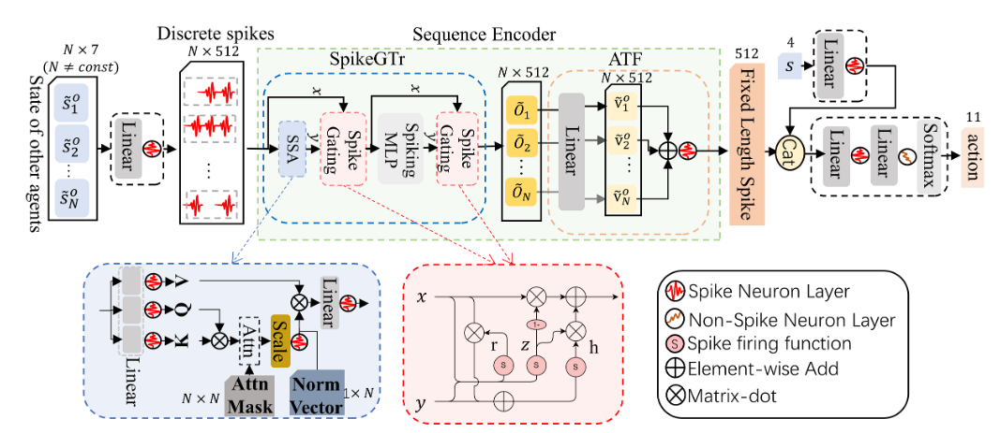

# CASRL
The source code for paper: CASRL: Collision Avoidance with Spiking Reinforcement Learning  Among Dynamic, Decision-Making Agents

To view our paper, please refer: [CASRL: Collision Avoidance with Spiking Reinforcement Learning Among Dynamic, Decision-Making Agents](https://doi.org/10.1109/IROS58592.2024.10802416). 

# Project Demo

<table>
  <tr>
    <td width="33%" align="center">
      <!-- <strong>Feature One</strong><br> -->
      
      <br>
      <em>4-random</em>
    </td>
    <td width="33%" align="center">
      <!-- <strong>Feature Two</strong><br> -->
      
      <br>
      <em>2-pair</em>
    </td>
    <td width="33%" align="center">
      <!-- <strong>Feature Three</strong><br> -->
      
      <br>
      <em>4-circle</em>
    </td>
  </tr>
</table>

## Method


## Prepare Python env 
<!-- python=3.8.13
```
# install torch
pip install torch==2.0.0+cu117 torchvision==0.15.0+cu117 torchaudio==2.0.0+cu117 --extra-index-url https://download.pytorch.org/whl/cu117
# install yolox
bash libs/download_install.sh
# install packages
pip install -r requirement.txt
``` -->


## Train 
```

```

## Eval 
```

```

## Citation
If our work help to your research, please cite our paper, thx.
```
@inproceedings{zhang2024casrl,
  title={Casrl: Collision avoidance with spiking reinforcement learning among dynamic, decision-making agents},
  author={Zhang, Chengjun and Yip, Ka-Wa and Yang, Bo and Zhang, Zhiyong and Yuan, Mengwen and Yan, Rui and Tang, Huajin},
  booktitle={2024 IEEE/RSJ International Conference on Intelligent Robots and Systems (IROS)},
  pages={8031--8038},
  year={2024},
  organization={IEEE}
}
```

## Thanks to these amazing projects:
- [rl_collision_avoidance](https://github.com/mit-acl/rl_collision_avoidance)
- [gym-collision-avoidance](https://github.com/mit-acl/gym-collision-avoidance)

